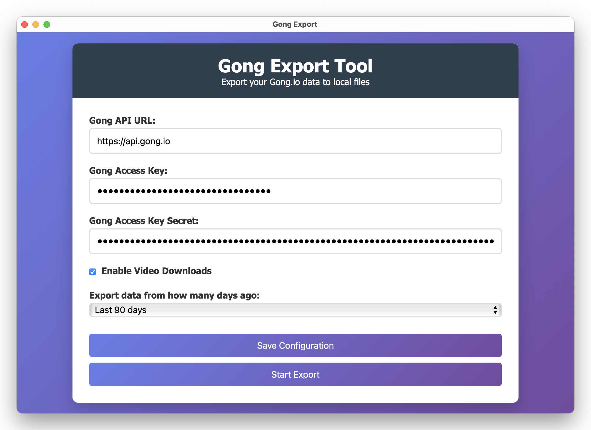

# Gong.io Data Export

A Node.js application to export company data from Gong.io via their API.



## Features

- Export call and conversation data (metadata, transcripts, recordings) using `/v2/calls/extensive` endpoint
- Export user and team information using `/v2/users` endpoint
- Export CRM and Engage data (when available)
- Export analytics and reporting data (when available)
- Logs information about call recording videos (MP4 files) from meeting URLs
  - **Note on Video Access**: The system attempts to download videos from Amazon S3 URLs, but these are typically access-restricted
  - A list of videos that need specific access is saved to `failed_video_downloads_*.json`
- Robust error handling and rate limiting for API calls (3 calls/sec, 10,000 calls/day)
- Saves exports to JSON files in the `exports/` directory
- Contains infrastructure for video downloads in `exports/videos/` directory

> **Note**: If the API endpoints have changed since development, the endpoints can be updated in the `src/api/gongExport.js` file.

## Prerequisites

- Node.js (LTS version recommended)
- Gong.io API key and access

## Accessing Video Recordings

According to Gong Support, the S3 URLs in the call metadata are not meant to be accessed directly. Gong protects recordings with time-limited, signed URLs to ensure secure access.

**How We Download Videos**:

This application uses two methods to obtain video URLs from Gong's API:

**Primary Method**: Uses the `/v2/calls/extensive` endpoint (POST) which returns call data including embedded video URLs in the `media.videoUrl` field.

**Fallback Method**: Uses the `/v2/calls/{callId}/media` endpoint (PUT) to generate signed URLs for individual calls when the extensive endpoint doesn't provide video URLs.

The application tries different HTTP methods (PUT with various content types, DELETE) to accommodate different Gong API configurations.

The application automatically:

1. Fetches call data from the `/v2/calls/extensive` endpoint with embedded video URLs
2. For calls without embedded URLs, requests signed URLs from `/v2/calls/{callId}/media`
3. Downloads the media using the obtained URLs (which may be time-limited)
4. Saves the videos to the `exports/videos/` directory

If any videos fail to download, details will be saved in a `failed_video_downloads_*.json` file for reference.

**Troubleshooting Video Access**: 

The Gong API can have different configurations for accessing media files. If you're experiencing issues:

1. **Disable Video Downloads**: Video downloads are disabled by default (since you've been having issues).
   - To enable: Edit `src/export.js` and change `enableVideoDownloads = false` to `true`

2. **Check API Permissions**: Your Gong API credentials might need specific permissions for media access.
   - Contact your Gong administrator to ensure your credentials have the necessary permissions

3. **API Method Limitations**: Your Gong instance may not support the standard API methods for downloading media.
   - In this case, use the Gong web interface to access videos

The export of call metadata and user data will work regardless of video download capabilities.

## Installation

1. Clone this repository:
   ```
   git clone <repository-url>
   cd gongexport
   ```

2. Install dependencies:
   ```
   npm install
   ```

3. Create a `.env` file in the project root with your Gong.io API credentials:
   ```
   cp .env.example .env
   ```
   Then edit the `.env` file to add your Gong.io API key and URL.

## Usage

### Command Line

Run the export process directly:

```
npm run export
```

Or use the trigger script:

```
npm run trigger
```

### API Usage

You can also use the export functionality in your own code:

```javascript
const exportGongData = require('./src/export');

exportGongData()
  .then(data => {
    console.log('Export successful:', Object.keys(data));
  })
  .catch(error => {
    console.error('Export failed:', error);
  });
```

## Project Structure

- `/src`: Source code
  - `/api`: API integration with Gong.io
  - `/config`: Configuration management
  - `/utils`: Utility functions (logging, etc.)
- `/logs`: Log files

## Logging

Logs are stored in the `/logs` directory:
- `error.log`: Error-level logs
- `combined.log`: All logs (info, warn, error)

## License

ISC
